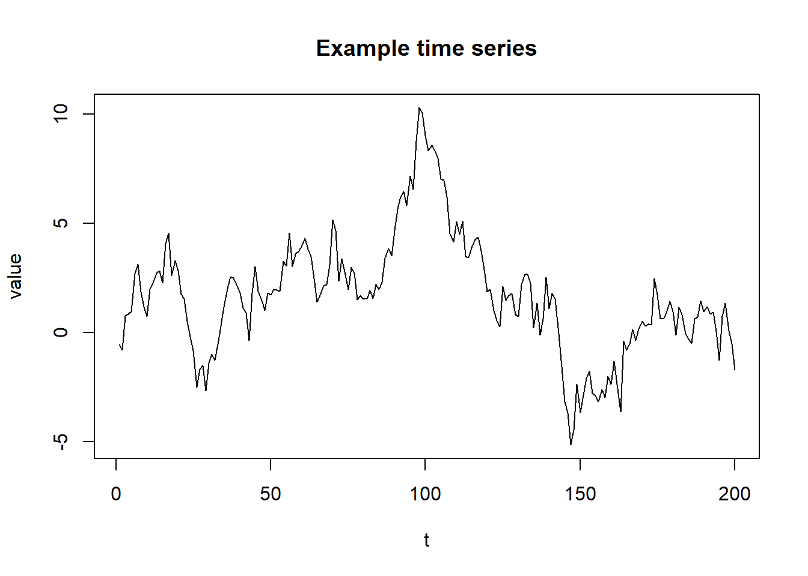

# Workflow

## Typical analysis workflow

1. Data import
2. Data cleaning
3. Exploratory Data Analysis (EDA)
4. Modelling
5. Reporting

## Example: simple plot


``` r
set.seed(123)
y <- cumsum(rnorm(200))
plot(y, type = "l", main = "Example time series", xlab = "t", ylab = "value")
```


